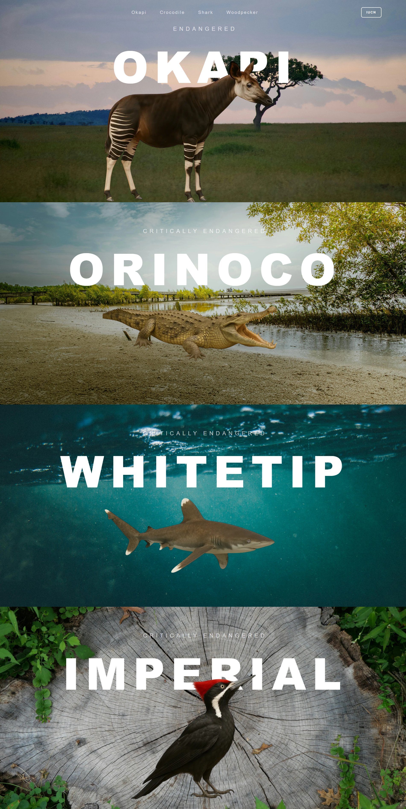
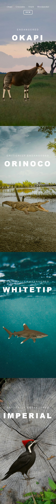

# Animal Extinction 🆘

## Purpose 🗺️
The **Animal Extinction** project aims to raise awareness about endangered species such as the Okapi, Orinoco Crocodile, Whitetip Shark, and Imperial Woodpecker. It provides information about their conservation status, habitats, and threats, encouraging users to explore efforts to protect these animals.

## Technologies 🧑‍💻

## Features 📌
- **Responsive Design**: Optimized for mobile and desktop devices.
- **SEO Optimized**: Includes meta tags, structured data, and descriptive content for better search engine visibility.
- **Interactive Animations**: Uses CSS animations to enhance user experience.
- **External Links**: Directs users to the [IUCN Red List](https://www.iucnredlist.org/es) for more detailed information about each species.

## Example Capture 📷
Below is an example of the webpage

### Desktop 🖥️

### Mobile 📱

## Links 🌐

<a href=""><h3>Live Demo 🛜</h4></a>

<a href="https://www.iucnredlist.org/es"><h3>IUCN Red List 🐾</h3></a>